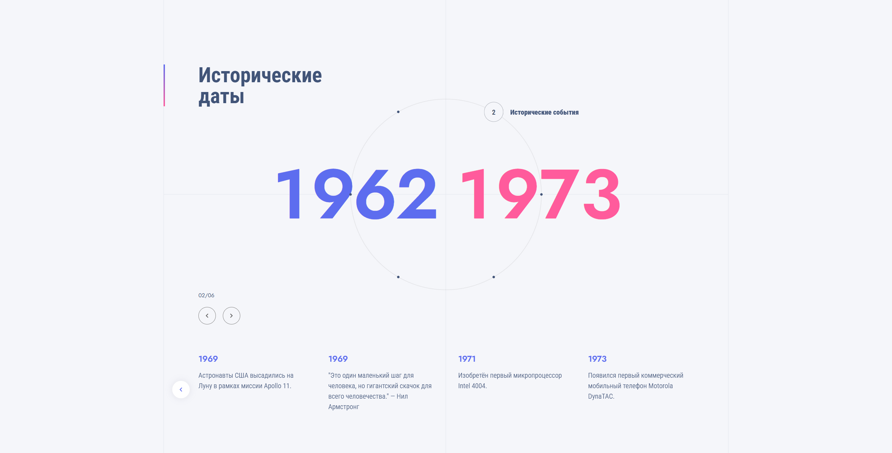
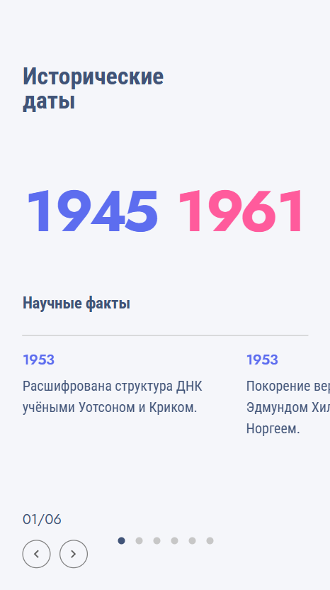

## Превью разных версий

<p align="center">
  
  
</p>

## Запуск проекта

1. Установи зависимости ( лучше через ci чтоб не было конфликтов разных либ ):
     ```bash
     npm ci
     ```
2. Запусти проект в режиме разработки:

     ```bash
     npm start
     ```

     Проект будет доступен по адресу http://localhost:3000

3. Для сборки production-версии:
     ```bash
     npm run build
     ```

## Запуск проекта

-    `src/`
     -    `App.tsx` — основной компонент
     -    `index.tsx` — энтри поинт
     -    `index.html` — шаблон HTML
     -    `mock.ts`, `types.ts` — мок-данные и типы
     -    `assets/` — статические ресурсы
          -    `icons/` — SVG-иконки (ChevronLeft, ChevronRight, TimelineCircle)
     -    `components/` — основные компоненты временной шкалы:
          -    `TimelineControls/` — элементы управления (кнопки навигации и т.д.)
          -    `TimelineDates/` — анимированные даты от и до
          -    `TimelineGrid/` — визуальная сетка
          -    `TimelineMinipoints/` — мини-точки событий ( пагинация для точек таймлайна )
          -    `TimelinePoint/` — основная точка события
          -    `TimelineSwiper/` — свайпер со слайдами текущей темы
     -    `constants/` — константы ( активный элемент по умолчанию )
     -    `hooks/` — пользовательские хуки (useAnimatedDates, useTimelineWheel)
     -    `styles/` — SCSS-стили (главные + переменные)
-    `webpack.config.js` — конфиг вебпака
-    `tsconfig.json` — конфиг TypeScript
-    `package.json` — зависимости
