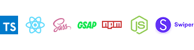

# 🎥 Превью 
<br>
<p align="center">
  <a href="https://drive.google.com/file/d/1-7ZU9aGZnCmj4bY-RcmQ2RaHXv4hkySa/view?usp=drive_link" target="_blank">Смотреть видео-превью</a>
  <br/>
  
  
</p>

<br>

# 🏁 Запуск проекта
<br>

1. 📥 Склонируй репозиторий или скачай архив с GitHub Releases и распакуй.
     ```bash
     Invoke-WebRequest -Uri "https://github.com/RadugaDuga/OnlyTest/archive/refs/heads/main.zip" -OutFile "OnlyTest-main.zip"
     ```
2. 📦 Установи зависимости (лучше через ci чтоб не было конфликтов разных либ ):

     ```bash
     npm ci
     ```

3. 🚀 Запусти проект в режиме разработки (адрес - http://localhost:3000):

     ```bash
     npm start
     ```
     
4. 🛠️ Для сборки production-версии используй:
     ```bash
     npm run build
     ```

<br>

# 📁 Структура файлов

-    `src/`

     -    `App.tsx` — основной компонент
     -    `index.tsx` — энтри поинт
     -    `index.html` — шаблон HTML
     -    `mock.ts`, `types.ts` — мок-данные и типы для них
     -    `assets/`
          -    `icons/` — SVG-иконки
     -    `components/` — основные компоненты временной шкалы:
          -    `TimelineControls/` — кнопки переключения активного события таймлайна
          -    `TimelineDates/` — анимированные даты от и до
          -    `TimelineGrid/` — визуальная сетка
          -    `TimelineMinipoints/` — мини-точки событий ( пагинация для точек таймлайна )
          -    `TimelinePoint/` — точка события на таймлайне
          -    `TimelineSwiper/` — свайпер со слайдами текущей темы
     -    `constants/` — константы ( активный элемент по умолчанию )
     -    `hooks/` — пользовательские хуки
          -    `useAnimatedDates/` — хук для анимации дат от и до
          -    `useTimelineWheel/` — хук для анимации главного колеса
     -    `styles/` — SCSS-стили (главные + переменные)

-    `webpack.config.js` — конфиг вебпака
-    `tsconfig.json` — конфиг TypeScript
-    `package.json` — зависимости
